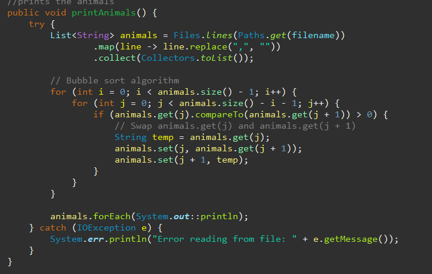

# 
Computer Science Capstone

  
## 
CS-499 | SNHU

## Professional Self-Assessment
My time in the Computer Science program at Southern New Hampshire University has helped shape my skills in programming. This eportfolio will show my skills in planning and developing industry-standard code. This eportfolio will be targeting my skills in three categories: Software Design and Engineering, Algorithms and Data Structures, and Databases. 

The first project displays my knowledge of Software Design and Engineering. It is a project that renders a 3D image of an air hockey table that the user can float around using the keyboard. This program allows me to show my skills with the openGL programming interface. The second project is on Algorithms and Data Structures. This project is a java project that was created for a animal rescue company. This project demonstrates my skills in jave which shows my Object-Oriented Programming skills. My third project is on databases. This project is an android application that tracks weights inputted by the user and placed in a database as well as new accounts informations. This project displays my skills in database with SQLite.

Before Southern New Hampshire I went to a technical college in South Carolina to get an associates in computer programming and three certificates in: internet programming, microcomputer programming, and a database administrator certificate. Along with all of the classes at Southern New Hampshire University, I have gained more knoledge than just the three required in this course. Some of the skills I have learned is callaborating in a team environment as well as software engineering and databases as at the technical college for my senior project my team and I had to design a system for a doctors office that they could use for makiing appointments and updating information of the patients. The patients were also able to use the system as it was a website. For data structures and algorithms at the technical college I had classes using OOP in java using many sorting and searching algorithms. For security I will go back to the technical colleges senior project as we had logins for the users that allowed us to use SHA-256 to encode passwords as well as many other classes had me use that as well.

Each artifact had its own purpose in this portfolio. For the first project it is to demonstrate the software and engineering and design as creating a 3D render of a airhockey table has to be designed properly or issues will arrise. The data structures and algorithms portion works perfectly for the project 2 as the sorting method is a great example of what to look for with an algorithm. The database project is perfect as I use two databses for this program and each database has a different design as well as the program uses a security mindset as the app requires logins to open.

#### 
CODE REVIEW

##### Project 1: Software Engineering and Design

<code>See the artifact's code review <a href="https://youtu.be/zTK3yx63vlM">here</a>.</code>

##### Project 2: Algorithms and Data Structures

<code>See the artifact's code review <a href="https://youtu.be/y0UvEotS7NA">here</a>.</code>

##### Project 3: Databases

<code>See the artifact's code review <a href="https://youtu.be/KBWjrAvvmic">here</a>.</code>

#### 
Project 1: Software Engineering and Design

  

<code>See the artifact's code and narrative <a href="https://github.com/Russellwillis/Russellwillis.github.io/tree/main/CS330%20Final%20-%20Software%20Engineering%20and%20Design">here</a>.</code>

##### Description

For this project I decided to chose the artifact from CS 330: Computational Graphics and Visualization. The artifact was part of the final project, which was to create a 3D render of an image. The image I chose to render was a air hockey table.
##### Justification

I chose this artifact as I felt it would allow me to change the original programs design from using GLUTs structure to using the GLFW structure.
##### Reflection

For my reflection on this artifacts enhancement, I learned how to do more with GLFW as it is definetly harder to implement certain structures than if I were to use GLUT.
#### 
Project 2: Algorithms and Data Structures

 

<code>See the artifact's code  and narrative <a href="https://github.com/Russellwillis/Russellwillis.github.io/tree/main/IT%20145%20-%20Algorithms%20and%20data%20structure/Enhanced">here</a>.</code>

##### Description

For this project I chose the artifact from IT 145: Foundation in Application Development. The artifact was part of the final project, which was to make a anuimal rescue program in Java for the driver of the rescue vehicle to receive in different animals(Dogs or Monkeys)

##### Justification

I chose this artifact so I can showcase my skills in data structures and algorithms as I have implemented sorting methods for the display list.

##### Reflection

In this artifact I learned more about different algorithms to figure out which one suited my program best to my liking.

#### 
Project 3: Databases

 

<code>See the artifact's code  and narrative <a href="https://github.com/Russellwillis/Russellwillis.github.io/tree/main/CS360%20-%20Databases">here</a>.</code>

##### Description

This project I chose to use the artifact from CS 360: Mobile Architecture and Programming. This artifact was the final project of that class. It was to create an app that tracks the daily weights inputted by the user.

##### Justification

I chose this artifact to showcase my skills in databases and to show my improvement on creating apps for phones.
##### Reflection

In this artifact I learned more about databases and how to make sure they are correct or else the programs will constantly crash.
